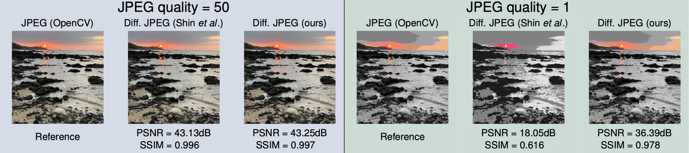

# Differentiable JPEG: The Devil is in the Details

[](https://arxiv.org/abs/2309.06978)
[](https://opensource.org/licenses/BSD-3-Clause)
[](https://pytorch.org/)

**[Christoph Reich](https://christophreich1996.github.io)
, [Biplob Debnath](https://www.nec-labs.com/research/integrated-systems/people/biplob-debnath/)
, [Deep Patel](https://deepsworld.github.io)
& [Srimat Chakradhar](https://www.nec-labs.com/research/integrated-systems/people/srimat-t-chakradhar/)**<br/>

## | [Project Page](https://christophreich1996.github.io/differentiable_jpeg/) | [Paper](https://arxiv.org/abs/2309.06978) | [Poster](https://christophreich1996.github.io/pdfs/WACV_Poster.pdf) | [Talk](https://christophreich1996.github.io/images/WACV_Talk_2.mp4) |

<p align="center">
  
</p>

<p align="center">
  This repository includes the <b>official</b> and <b>maintained</b> implementation of the differentiable JPEG approach proposed in the paper <a href="https://arxiv.org/abs/2308.12116">Differentiable JPEG: The Devil is in the Details</a>.
</p>

## Abstract

*JPEG remains one of the most widespread lossy image coding methods. However, the non-differentiable nature of JPEG
restricts the application in deep learning pipelines. Several differentiable approximations of JPEG have recently been
proposed to address this issue. This paper conducts a comprehensive review of existing differentiable JPEG approaches
and identifies critical details that have been missed by previous methods. To this end, we propose a novel
differentiable JPEG approach, overcoming previous limitations. Our approach is differentiable w.r.t. the input image,
the JPEG quality, the quantization tables, and the color conversion parameters. We evaluate the forward and backward
performance of our differentiable JPEG approach against existing methods. Additionally, extensive ablations are
performed to evaluate crucial design choices. Our proposed differentiable JPEG resembles the (non-differentiable)
reference implementation best, significantly surpassing the recent-best differentiable approach by 3.47dB (PSNR) 
on average. For strong compression rates, we can even improve PSNR by 9.51dB. Strong adversarial attack results
are yielded by our differentiable JPEG, demonstrating the effective gradient approximation.*

**If you use our differentiable JPEG or find this research useful in your work, please cite our paper:**

```bibtex
@inproceedings{Reich2024,
    author={Reich, Christoph and Debnath, Biplob and Patel, Deep and Chakradhar, Srimat},
    title={{Differentiable JPEG: The Devil is in the Details}},
    booktitle={{WACV}},
    year={2024}
}
```

## Installation

Our differentiable JPEG implementation can be installed as a Python package by running:

```shell script
pip install git+https://github.com/necla-ml/Diff-JPEG
```

All dependencies are listed in [requirements.txt](requirements.txt).

## Usage

We offer both a functional and class ([nn.Module](https://pytorch.org/docs/stable/generated/torch.nn.Module.html))
implementation of our differentiable JPEG approach. Note beyond the examples provided here we also have
an [example.py](example.py) file.

The following example showcases the use of the functional implementation.

```python
import torch
import torchvision
from torch import Tensor

from diff_jpeg import diff_jpeg_coding

# Load test image and reshape to [B, 3, H, W]
image: Tensor = torchvision.io.read_image("test_images/test_image.png").float()[None]
# Init JPEG quality
jpeg_quality: Tensor = torch.tensor([2.0])
# Perform differentiable JPEG coding
image_coded: Tensor = diff_jpeg_coding(image_rgb=image, jpeg_quality=jpeg_quality)
```

In the following code example, the class ([nn.Module](https://pytorch.org/docs/stable/generated/torch.nn.Module.html))
implementation is used.

```python
import torch
import torch.nn as nn
import torchvision
from torch import Tensor

from diff_jpeg import DiffJPEGCoding

# Init module
diff_jpeg_coding_module: nn.Module = DiffJPEGCoding()
# Load test image and reshape to [B, 3, H, W]
image: Tensor = torchvision.io.read_image("test_images/test_image.png").float()[None]
# Init JPEG quality
jpeg_quality: Tensor = torch.tensor([19.04])
# Perform differentiable JPEG coding
image_coded: Tensor = diff_jpeg_coding_module(image_rgb=image, jpeg_quality=jpeg_quality)
```

### STE Variant

To utilize the proposed straight-through estimator (STE) variant just set the `ste: bool = True` parameter.

```python
# Perform differentiable JPEG coding
image_coded: Tensor = diff_jpeg_coding(image_rgb=image, jpeg_quality=jpeg_quality, ste=True)
```

```python
# Init module
diff_jpeg_coding_module: nn.Module = DiffJPEGCoding(ste=True)
```

### Custom Quantization Tables

Both the `diff_jpeg_coding` function and the forward function of `DiffJPEGCoding` offer the option to use custom
quantization tables. Just use the `quantization_table_y: Optional[Tensor]` and `quantization_table_c: Optional[Tensor]`
parameter. Both parameters are required to be a `torch.Tensor` of the shape `[8, 8]`. If no quantization table is
given (or set to `None`), the respective standard JPEG quantization tables are utilized.

Here we provide two examples of using a custom quantization table.

```python
import torch
import torchvision
from torch import Tensor

from diff_jpeg import diff_jpeg_coding

# Load test image and reshape to [B, 3, H, W]
image: Tensor = torchvision.io.read_image("test_images/test_image.png").float()[None]
# Init JPEG quality
jpeg_quality: Tensor = torch.tensor([2.0])
# Perform differentiable JPEG coding
image_coded: Tensor = diff_jpeg_coding(
    image_rgb=image,
    jpeg_quality=jpeg_quality,
    quantization_table_y=torch.randint(low=1, high=256, size=(8, 8)),
    quantization_table_c=torch.randint(low=1, high=256, size=(8, 8)),
)
```

```python
import torch
import torch.nn as nn
import torchvision
from torch import Tensor

from diff_jpeg import DiffJPEGCoding

# Init module
diff_jpeg_coding_module: nn.Module = DiffJPEGCoding()
# Load test image and reshape to [B, 3, H, W]
image: Tensor = torchvision.io.read_image("test_images/test_image.png").float()[None]
# Init JPEG quality
jpeg_quality: Tensor = torch.tensor([19.04])
# Perform differentiable JPEG coding
image_coded: Tensor = diff_jpeg_coding_module(
    image_rgb=image,
    jpeg_quality=jpeg_quality,
    quantization_table_y=torch.randint(low=1, high=256, size=(8, 8)),
    quantization_table_c=torch.randint(low=1, high=256, size=(8, 8)),
)
```

## Issues

If you encounter any issues with this implementation please open a GitHub issue!
